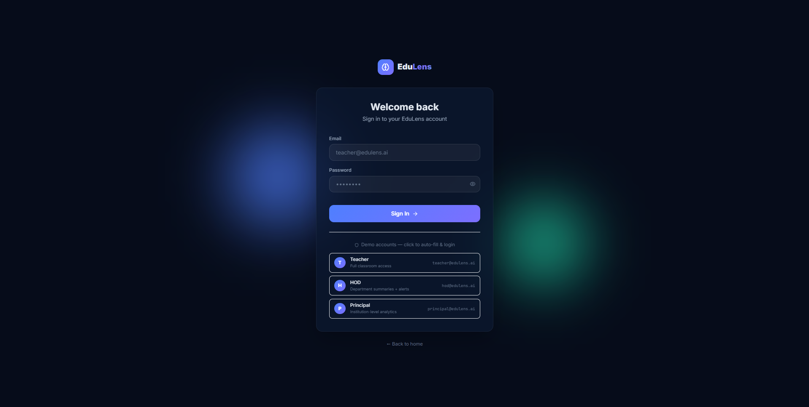
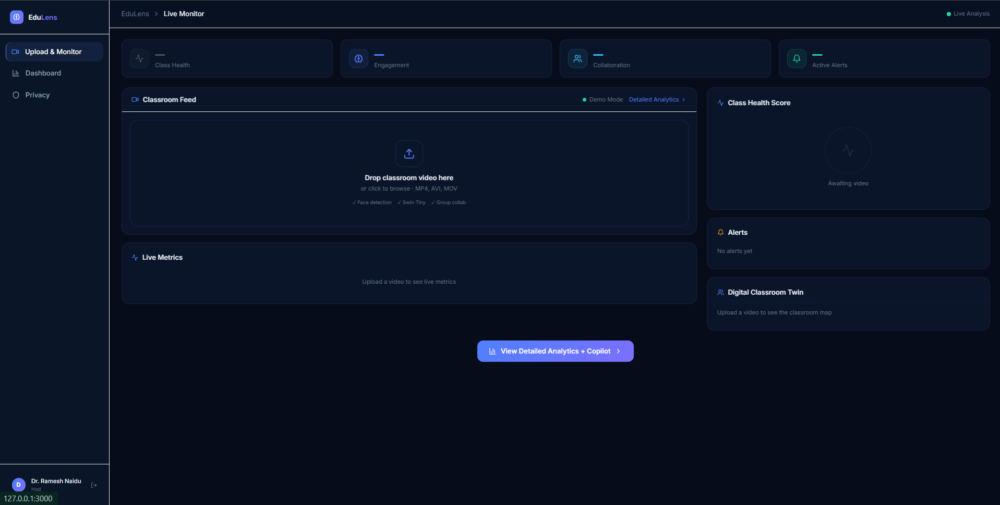
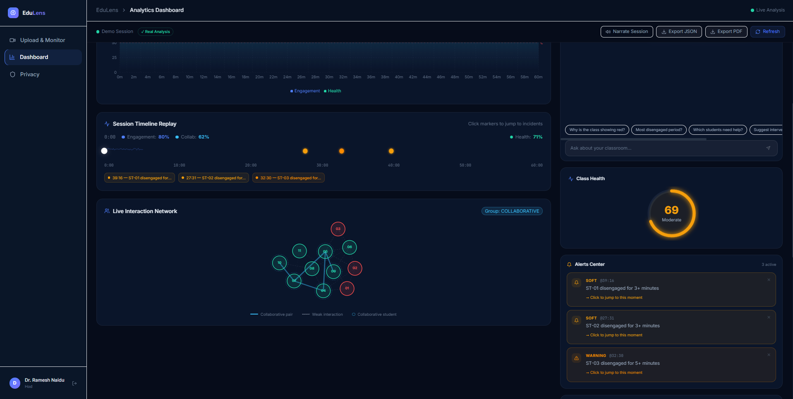
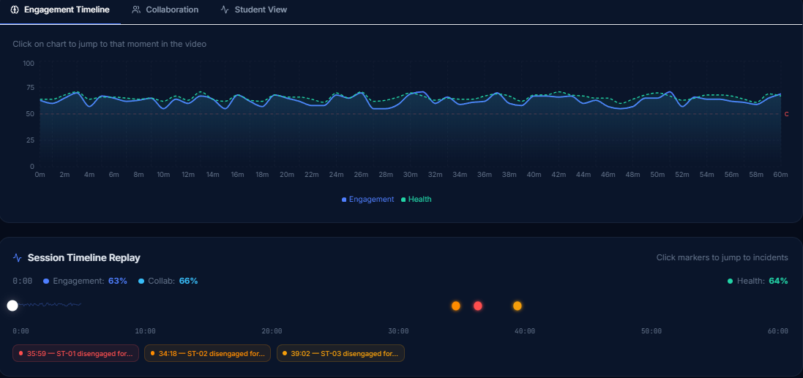
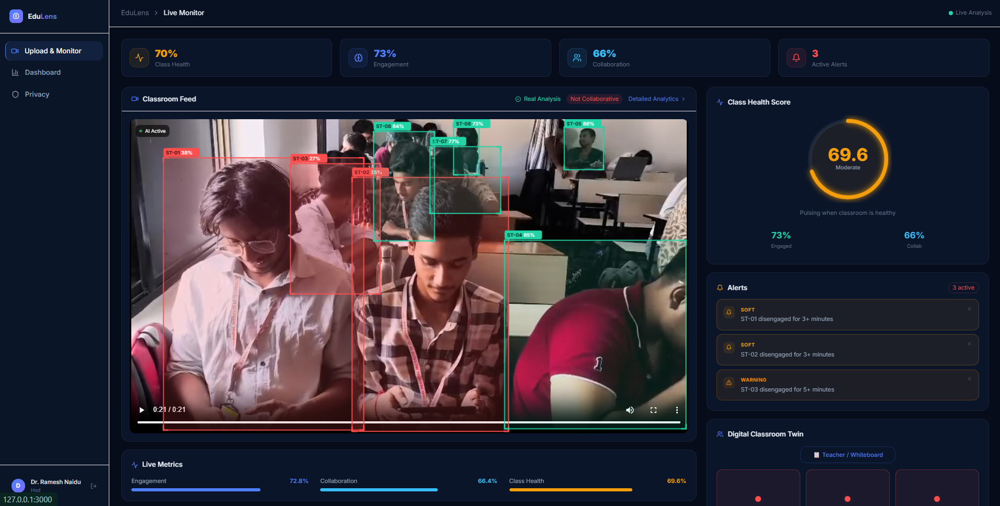
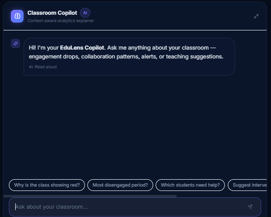
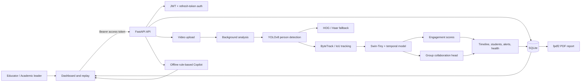
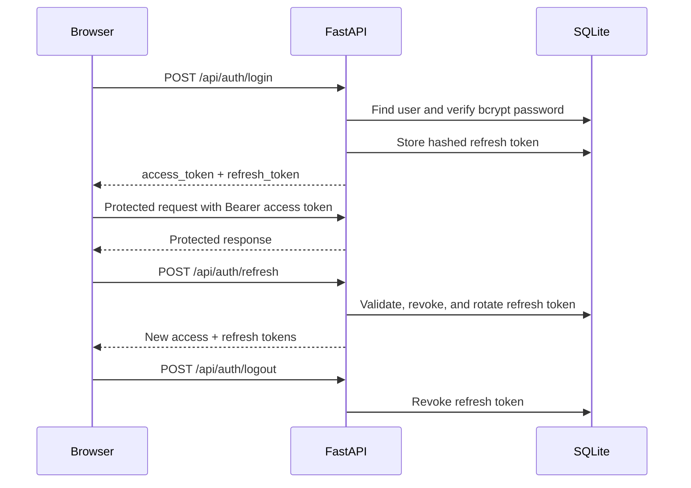

# EduLens AI

### AI-powered classroom engagement and collaboration analytics

[](https://www.python.org/)
[](https://fastapi.tiangolo.com/)
[](https://nextjs.org/)
[](https://pytorch.org/)
[](LICENSE)

EduLens turns classroom video into an actionable view of student engagement,
group collaboration, classroom health, alerts, and session timelines. It pairs
a Next.js dashboard with a FastAPI inference service and a research-oriented
computer-vision pipeline built around Swin-Tiny temporal features.

> **Project status:** MVP Release (v1.0.0)

## Project banner

```text
┌──────────────────────────────────────────────────────────────────────────┐
│  EDULENS                                                                 │
│  See the classroom. Understand the moment. Support the learner.          │
│                                                                          │
│  Video → Detection → Tracking → Engagement → Collaboration → Insight    │
└──────────────────────────────────────────────────────────────────────────┘
```

## Overview

EduLens is designed for educators and academic leaders who need a compact,
interpretable summary of classroom activity. A teacher uploads a classroom
video, starts analysis, and reviews the resulting timeline and per-student
signals. HOD and principal roles can inspect aggregate analytics and alerts.

The application currently provides:

- video upload and asynchronous analysis sessions;
- per-session engagement, collaboration, and class-health scores;
- tracked person detections and timeline replay data;
- alert generation for sustained low engagement;
- a rule-based classroom Copilot that works offline;
- PDF report generation with `fpdf2`;
- JWT access tokens and rotating, database-backed refresh tokens; and
- YOLOv8 person detection with HOG/Haar fallbacks when Ultralytics is not
  available.

## Highlights

- 🔐 JWT Authentication + Refresh Token Rotation
- 🛡️ Cloudflare Turnstile CAPTCHA
- 👨‍🏫 Role-Based Access Control (Teacher / HOD / Principal)
- 🎥 Classroom Video Analytics
- 🤖 AI Copilot
- 📊 Engagement & Collaboration Metrics
- 📄 PDF & JSON Reports

## Demo accounts

Use these seeded local accounts to explore the application:

| Role | Email | Password |
|---|---|---|
| Teacher | teacher@edulens.ai | demo123 |
| HOD | hod@edulens.ai | demo123 |
| Principal | principal@edulens.ai | demo123 |

Change or remove demo credentials before deploying outside a local evaluation
environment.

## Features

### Classroom monitoring

- Upload MP4, AVI, MOV, or MKV classroom recordings.
- Start analysis as a background task and poll progress from the dashboard.
- View engagement and collaboration timelines.
- Inspect detected students, bounding boxes, alerts, and session health.
- Replay the most important moments from the analyzed timeline.

### Collaboration intelligence

- Extract per-person temporal features from the Swin-Tiny backbone.
- Compute pair and group interaction signals.
- Produce a collaboration verdict alongside engagement metrics.
- Preserve per-frame detection data for frontend overlays.

### Operations and reporting

- Generate a downloadable PDF session report.
- View dashboard aggregates for HOD and principal users.
- Ask the offline Copilot questions about a completed session.
- Keep audit events, sessions, alerts, and refresh tokens in SQLite.

## Screenshots

The following screens show the main reviewer journey through EduLens.

| Login | Dashboard | Analytics |
|---|---|---|
|  |  |  |

| Timeline | Replay | AI Copilot |
|---|---|---|
|  |  |  |

Recommended screenshots contain representative, anonymized data only. Do not commit classroom footage, student faces, tokens, or personal data.

## Demo

Follow the complete reviewer flow: Login → Upload Video → Analysis → Dashboard → Timeline → Copilot.


## Architecture diagram



## Authentication flow



Access tokens default to 30 minutes. Refresh tokens default to seven days and
are stored as SHA-256 hashes rather than plaintext values.

Login can optionally be protected with Cloudflare Turnstile. Enable it with TURNSTILE_ENABLED=true and provide the corresponding site and secret keys through the environment variables above.

## Tech stack

| Layer | Technologies |
|---|---|
| Frontend | Next.js 14, React 18, TypeScript, Tailwind CSS |
| Visualization | Recharts, D3, Framer Motion, Lucide React |
| Client state and API | Zustand, Axios |
| Backend | Python, FastAPI, Uvicorn, Pydantic |
| Authentication | JWT, `python-jose`, bcrypt, OAuth2-compatible login |
| Persistence | SQLite with WAL mode |
| Computer vision | OpenCV, Ultralytics YOLOv8, HOG/Haar fallback |
| Deep learning | PyTorch, Torchvision, timm, Swin-Tiny |
| Reports | fpdf2 |
| Verification | Pytest tests under `backend/tests/` |

## Folder structure

```text
.
├── backend/
│   ├── main.py                 # FastAPI application and inline analytics routes
│   ├── config.py               # Environment-backed configuration
│   ├── database.py             # SQLite schema and persistence helpers
│   ├── security.py             # Password, JWT, and refresh-token helpers
│   ├── dependencies.py         # Authentication and role dependencies
│   ├── routers/                # Auth, sessions, and Copilot endpoints
│   ├── services/               # Inference, CAPTCHA, alerts, and PDF reports
│   ├── tests/                  # Backend tests
│   ├── .env.example            # Backend environment template
│   └── requirements.txt        # Backend/runtime dependency lock list
├── frontend/
│   ├── app/                    # Next.js routes and pages
│   ├── components/             # Dashboard, replay, auth, and UI components
│   ├── lib/api.ts              # Axios client and response mapping
│   ├── package.json            # Frontend scripts and dependencies
│   └── .env.local.example      # Frontend environment template
├── src/
│   ├── models/                 # Swin and collaboration models
│   ├── inference/              # Detection, tracking, and collaboration logic
│   ├── data/                   # Dataset and feature preparation tools
│   ├── training/               # Training scripts
│   └── eval/                   # Evaluation and plotting scripts
├── weights/                    # Optional trained checkpoints
├── custom_dataset/             # Dataset metadata and annotations
├── data/                       # Prepared splits and extracted features
├── yolov8n.pt                 # YOLOv8n detector weights
├── start_backend.bat           # Windows backend launcher
└── start_frontend.bat          # Windows frontend launcher
```

## Installation

### Prerequisites

- Python 3.10 or newer;
- Node.js 18.17 or newer and npm;
- enough disk space for PyTorch, model weights, and video files; and
- optional CUDA-compatible hardware for faster inference.

Clone the repository and create a virtual environment:

```bash
git clone <repository-url>
cd EduLens-AI
python -m venv .venv
```

Activate it on Windows PowerShell:

```powershell
.\.venv\Scripts\Activate.ps1
```

Activate it on macOS/Linux:

```bash
source .venv/bin/activate
```

## Backend setup

Install the backend dependencies and create the environment file:

```bash
python -m pip install --upgrade pip
python -m pip install -r backend/requirements.txt
copy backend\.env.example .env       # Windows
# cp backend/.env.example .env        # macOS/Linux
```

Generate a strong `SECRET_KEY` and replace the placeholder in `.env`. Start
the API from the repository root:

```bash
python -m uvicorn backend.main:app --host 0.0.0.0 --port 8000 --reload
```

The backend will initialize `backend/edulens.db` and create the upload and
report directories on demand. API documentation is available at:

- Swagger UI: `http://localhost:8000/docs`
- ReDoc: `http://localhost:8000/redoc`
- Health check: `http://localhost:8000/health`

On Windows, `start_backend.bat` can also be used. It installs a smaller set
of runtime packages and starts Uvicorn, while `backend/requirements.txt` is
the fuller dependency declaration for the project.

## Frontend setup

Install and run the Next.js application:

```bash
cd frontend
npm install
npm run dev
```

Open `http://localhost:3000`. The frontend uses `/api` as its Axios base path;
configure a reverse proxy or Next.js rewrite to forward it to the FastAPI
server when running the frontend separately.

For a production build:

```bash
npm run build
npm start
```

The Windows shortcut is `start_frontend.bat`.

## Environment variables

Create `.env` at the repository root from `backend/.env.example`:

| Variable | Required | Default | Description |
|---|---:|---|---|
| `SECRET_KEY` | yes | — | JWT signing secret; use a unique random value |
| `ALGORITHM` | no | `HS256` | JWT signing algorithm |
| `ACCESS_TOKEN_EXPIRE_MINUTES` | no | `30` | Access-token lifetime |
| `REFRESH_TOKEN_EXPIRE_DAYS` | no | `7` | Refresh-token lifetime |
| `TURNSTILE_ENABLED` | no | `false` | Enable Cloudflare Turnstile login verification |
| `TURNSTILE_SITE_KEY` | no | empty | Public frontend Turnstile site key |
| `TURNSTILE_SECRET_KEY` | no | empty | Server-side Turnstile verification secret |

Never commit `.env`, production secrets, refresh tokens, uploaded videos, or
database files containing real user data.

## API reference

All protected endpoints use:

```http
Authorization: Bearer <access_token>
```

### Health and discovery

| Method | Path | Access | Purpose |
|---|---|---|---|
| GET | `/health` | Public | Service health check |
| GET | `/` | Public | API information and endpoint summary |

### Authentication

| Method | Path | Access | Purpose |
|---|---|---|---|
| POST | `/api/auth/login` | Public | JSON login; optionally validates Turnstile |
| POST | `/api/auth/login/oauth` | Public | OAuth2 form login for Swagger UI |
| POST | `/api/auth/refresh` | Public | Rotate a refresh token |
| POST | `/api/auth/logout` | Public | Revoke a refresh token |

`/api/auth/login` accepts `email`, `password`, and optional `captcha_token`.

### Sessions and reports

| Method | Path | Access | Purpose |
|---|---|---|---|
| POST | `/api/sessions/upload` | Teacher+ | Upload a classroom video |
| POST | `/api/sessions/{id}/analyze` | Owner | Start background analysis |
| GET | `/api/sessions` | Teacher+ | List recent sessions |
| GET | `/api/sessions/{id}` | Teacher+ | Read status and aggregate scores |
| GET | `/api/sessions/{id}/timeline` | Teacher+ | Read timeline, students, and alerts |
| GET | `/api/sessions/{id}/frames` | Owner / leadership | Read frame detections |
| GET | `/api/sessions/{id}/report` | Owner / leadership | Download PDF report |

### Analytics, alerts, and Copilot

| Method | Path | Access | Purpose |
|---|---|---|---|
| GET | `/api/analytics/dashboard` | HOD+ | Read aggregate dashboard statistics |
| GET | `/api/alerts` | HOD+ | Read alerts across sessions or one session |
| POST | `/api/copilot/ask` | Teacher+ | Ask a session-aware analytics question |

FastAPI remains the source of truth for request and response schemas; use
`/docs` for interactive examples.

## Security features

- bcrypt password hashing;
- signed JWT access tokens with expiration and issuance timestamps;
- opaque refresh tokens generated with secure randomness;
- SHA-256 hashing of refresh tokens at rest;
- refresh-token rotation and revocation on refresh/logout;
- role-based authorization for teacher, HOD, and principal users;
- session ownership checks for teacher access;
- audit logging for authentication events;
- optional Cloudflare Turnstile verification; and
- CORS configuration in the FastAPI application.

Before production deployment, restrict CORS to known origins, add upload-size
and file-content limits, move secrets to a secret manager, use HTTPS, review
retention and deletion policy for videos, and replace demo credentials.

## AI pipeline

1. The API stores an uploaded video as a session-owned file.
2. A background worker samples frames from the video.
3. Ultralytics YOLOv8n detects people when available.
4. ByteTrack or the project IoU tracker maintains person identities.
5. HOG and Haar detectors provide fallback paths when YOLO is unavailable.
6. The Swin-Tiny backbone extracts 768-dimensional temporal features.
7. The engagement head estimates per-person engagement.
8. Pair and group signals feed the collaboration head.
9. The service aggregates timeline, health, student, and alert outputs.
10. The frontend renders the results and can request a PDF report.

The backend service can fall back to a deterministic demo result when trained
weights or inference dependencies are unavailable. Treat demo output as UI
smoke-test data, not as a model evaluation result.

## Deployment

For a deployment environment:

1. Build the frontend with `npm run build`.
2. Run FastAPI behind a TLS-terminating reverse proxy.
3. Serve the Next.js application with `npm start` or a managed Node runtime.
4. Store SQLite, uploads, reports, and model weights on persistent volumes.
5. Configure a production `SECRET_KEY` and Turnstile credentials.
6. Replace wildcard CORS with the deployed frontend origin.
7. Add request limits, structured logs, backups, monitoring, and video-retention
   controls.

The current analysis implementation starts a Python background thread inside
the API process. For high-volume deployment, move analysis to a durable job
queue and separate worker service so jobs survive API restarts.

## Roadmap

- [ ] Add committed, anonymized product screenshots and a hosted demo.
- [ ] Replace in-process analysis threads with durable workers and a queue.
- [ ] Add automated video-size, duration, and codec validation.
- [ ] Add configurable retention and deletion workflows for uploaded videos.
- [ ] Add production database support and migrations.
- [ ] Improve test coverage for sessions, roles, refresh rotation, and reports.
- [ ] Add model versioning, evaluation reports, and calibration metrics.
- [ ] Add observability for inference latency, failures, and queue depth.
- [ ] Provide containerized local and production deployment recipes.

## Contributing

Contributions are welcome. Before opening a pull request:

1. Create a focused branch from the default branch.
2. Keep classroom data, secrets, generated reports, and large local artifacts
   out of commits.
3. Update the README when setup, endpoints, or model behavior changes.
4. Run the relevant backend tests and a frontend production build.
5. Explain model, privacy, and API behavior changes in the pull request.

Suggested checks:

```bash
python -m pytest backend/tests
cd frontend
npm run build
```

## License

This project is licensed under the MIT License. See the [LICENSE](LICENSE) file for details.

## Acknowledgements

EduLens builds on the Python, PyTorch, OpenCV, Ultralytics, FastAPI, Next.js,
and open-source scientific-computing ecosystems. Please review and comply
with the licenses of all direct and transitive dependencies before distribution.
